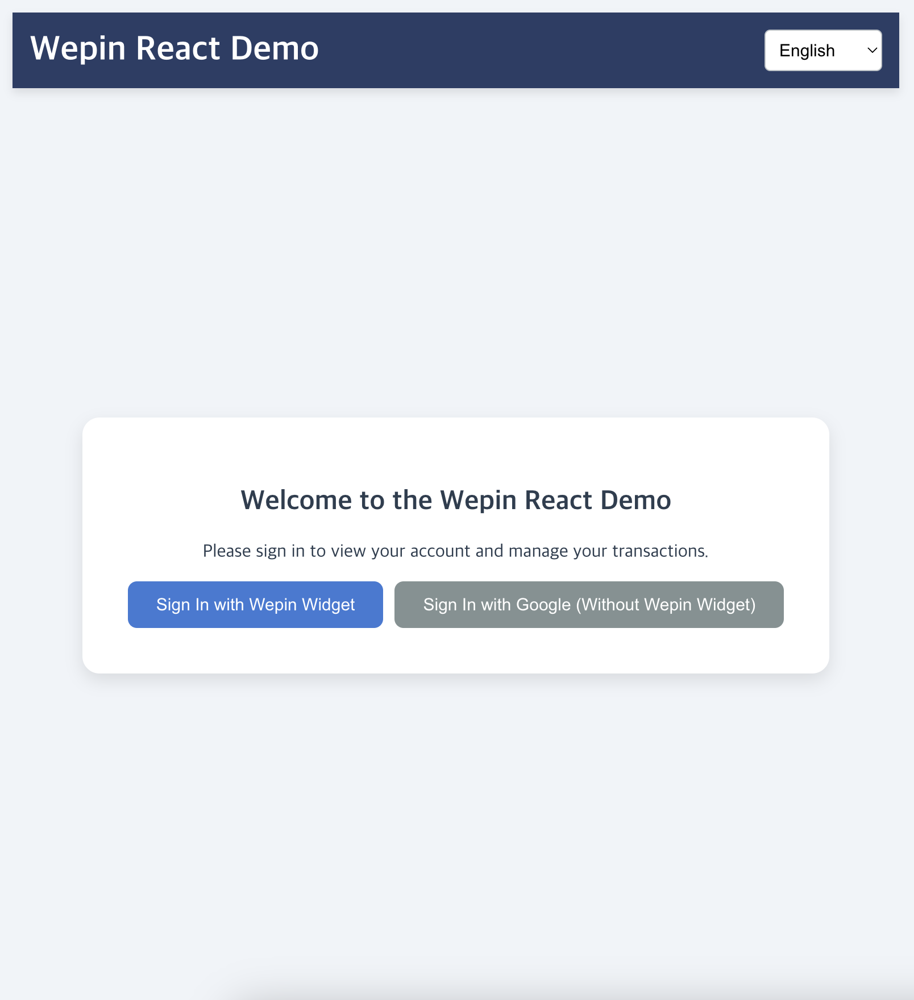
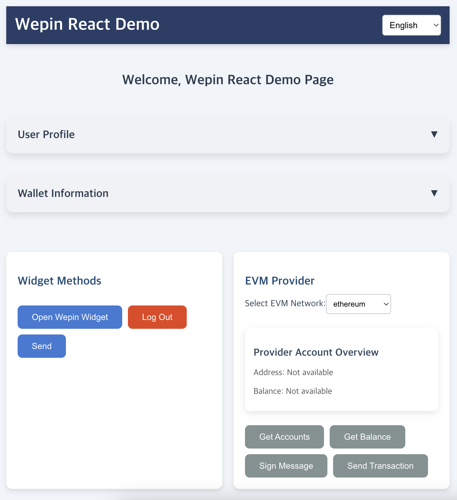

<br/>

<p align="center">
  <a href="https://www.wepin.io/">
      <picture>
        <source media="(prefers-color-scheme: dark)">
        
      </picture>
</a>
</p>

<br>


# Wepin React Example


[](https://docs.wepin.io/widget-integration/web-javascript-sdk)

[](https://react.dev/)

[](https://developer.mozilla.org/docs/Web/JavaScript)
[](https://www.typescriptlang.org/)


## ⏩ Get App ID and Key
After signing up for [Wepin Workspace](https://workspace.wepin.io/), go to the development tools menu and input the required information for your app platform. You will then receive your App ID and App Key.

## ⏩ Installation & Running the App
To run the Wepin React Example, you can use either npm or yarn. Follow the steps below:
```bash
npm install
npm run start
```
or
```bash
yarn
yarn start
```
This will run the app in development mode.
Once the app is running, open http://localhost:3000 in your browser to view it.

|  |  |
| ------------------------------------------------------------- | ------------------------------------------------------------- |
| Before Login                              | After Login                               |

